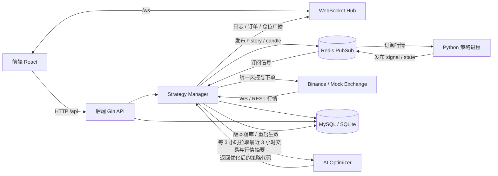
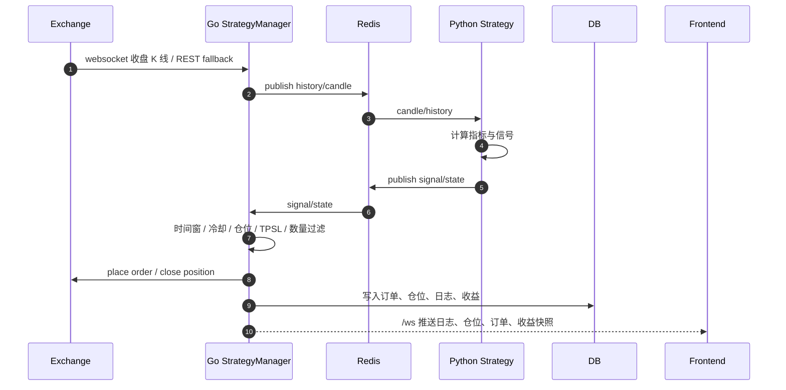
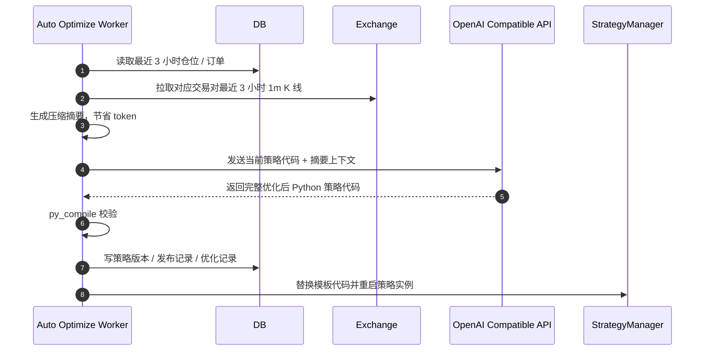
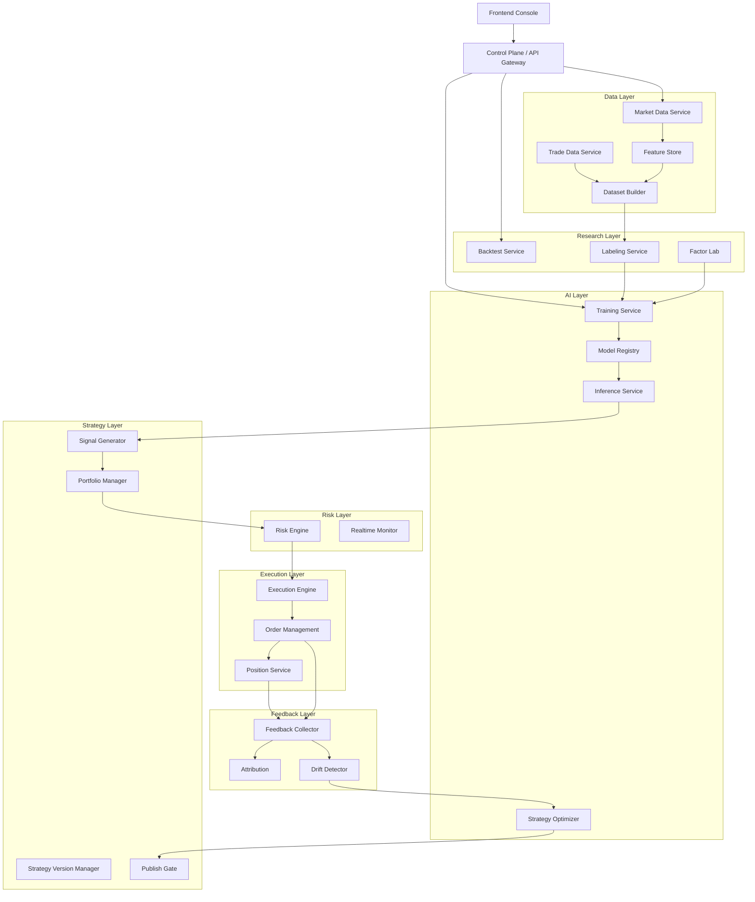

# QuantyTrade

`QuantyTrade` 当前是一个以 `Go 后端 + Python 策略 + Redis 消息总线 + React 前端` 为核心的量化交易平台，并正在向“AI 量化交易平台”演进。

它目前已经具备：

- 策略模板与策略实例管理
- 交易所行情接入与 websocket 推送
- Python 策略进程托管
- 后端统一风控、下单、仓位与订单台账
- 收益面板、日历收益、月度收益聚合
- AI 自动优化策略脚本的基础闭环

## 当前定位

当前项目本质上仍是一个“策略执行平台”：

- 前端负责配置、管理、观察
- Go 后端负责生命周期、行情、风控和执行
- Python 负责策略计算与信号生成
- Redis 负责 Go 和 Python 之间的消息传递

它还不是一个完整的数据驱动、模型驱动的 AI 量化中台，但已经具备向该方向重构的基础能力。

## 当前架构图

### 总览



### 实时交易链路



### AI 自动优化链路



## 目标架构图

项目的目标不是持续围绕单个 `v10/v11/v12` 脚本演化，而是逐步升级成 AI 量化交易平台。



更完整的目标架构设计见：

- `docs/ai_quant_platform_architecture.md`
- `docs/call_chain.md`

## 核心模块

### `backend/`

Go 后端，当前系统核心控制面与执行面：

- HTTP API 与鉴权
- 策略实例生命周期管理
- 行情订阅与 Redis 推送
- 信号接收、风控过滤、统一下单
- 收益面板与 dashboard 聚合
- AI 自动优化 worker

关键目录：

- `backend/cmd/`: 进程入口
- `backend/internal/api/`: HTTP API、收益与 dashboard
- `backend/internal/strategy/`: 策略管理、行情流、下单流、AI 自动优化
- `backend/internal/exchange/`: Binance / Mock 适配
- `backend/internal/models/`: GORM 模型
- `backend/internal/database/`: 数据库初始化与迁移

### `strategies/`

Python 策略模板目录：

- 策略模板源码放在这里
- 后端启动实例时会生成 `_runtime` 脚本执行
- 当前 `v10/v11` 都属于“脚本驱动策略”

### `frontend/`

React 控制台：

- 登录 / 注册
- 策略管理
- 模板管理
- 仓位和订单观察
- 收益总览、日历收益、月度收益
- AI 自动优化配置

### `docs/`

设计与链路文档：

- `call_chain.md`: 当前调用链
- `ai_quant_platform_architecture.md`: 目标 AI 平台架构与目录重构方案

## 当前主链路

### 1. 策略启动

1. 前端调用 `/api/strategies/:id/start`
2. Go 后端加载模板代码与实例配置
3. 生成 `strategies/_runtime/*.py`
4. 启动 Python 子进程
5. Python 发布 `ready` 状态
6. Go 收到 `ready` 后推送 200 根历史 K 线

### 2. 行情驱动

1. Go 订阅交易所 websocket 1m K 线
2. 收到已收盘 K 线后推送给 Python
3. 若 websocket 的 closed kline 延迟，会触发 REST fallback
4. Python 收到实时 candle 后计算信号

### 3. 信号执行

1. Python 发布 `SIGNAL open/close`
2. Go 接收信号并做统一过滤
3. Go 负责真正下单与风控
4. 订单、仓位、收益和日志写入数据库
5. 前端通过 `/ws` 和 `/api/stats/dashboard` 观察结果

### 4. 自动优化

1. 后端每分钟巡检策略实例
2. 满足间隔条件时，回看最近 3 小时订单、仓位和行情
3. 生成压缩摘要，调用 OpenAI 兼容接口
4. 新代码通过语法校验后自动替换模板并重启策略

## 数据推送模型

### 首次全量

- Python 策略启动后发布 `ready`
- 后端检测 `boot_id`
- 每个交易对推送一次 `history`
- 默认补 `200` 根 `1m` K 线

### 后续增量

- 后端收到交易所最新已收盘 `1m` K 线
- 发布单条 `candle`
- Python 只处理增量更新

### 重启恢复

- 如果脚本重启，`boot_id` 会变化
- 后端检测后再次推送 `history`
- 这样脚本即使失忆也能恢复计算状态

## Redis 协议

以 `REDIS_PREFIX=qt` 为例：

- 行情通道：`qt:candle:{strategy_id}`
- 信号通道：`qt:signal:{strategy_id}`
- 状态通道：`qt:state:{strategy_id}`

消息示例：

### 策略状态

```json
{"type":"ready","strategy_id":"...","boot_id":"...","created_at":"2026-03-22T12:34:56Z"}
```

### 行情全量

```json
{"type":"history","strategy_id":"...","symbol":"BTC/USDT","candles":[{"type":"candle","strategy_id":"...","symbol":"BTC/USDT","timestamp":"...","open":0,"high":0,"low":0,"close":0,"volume":0}]}
```

### 行情增量

```json
{"type":"candle","strategy_id":"...","symbol":"BTC/USDT","timestamp":"...","open":0,"high":0,"low":0,"close":0,"volume":0}
```

### 交易信号

```json
{"strategy_id":"...","owner_id":1,"symbol":"BTC/USDT","action":"open","side":"buy","amount":0.01,"take_profit":0,"stop_loss":0,"signal_id":"...","timestamp":"2026-03-22T12:34:56Z"}
```

## 收益与面板

当前 dashboard 已支持：

- 当日收益
- 近 7 日收益
- 本周收益
- 近 30 日收益
- 本月收益
- 本年收益
- 日历收益 `calendar`
- 月度收益聚合 `monthly`

相关实现主要在：

- `backend/internal/api/dashboard_builder.go`
- `backend/internal/api/daily_pnl_job.go`

## AI 自动优化说明

当前已经接入第一版 AI 优化闭环：

- 默认每 `3` 小时优化一次
- 默认回看最近 `3` 小时交易和市场摘要
- 优先发送压缩摘要，而不是整段 K 线，以节省 token
- AI 返回完整 Python 策略源码
- 通过 `py_compile` 校验后自动替换并重启策略

当前支持的前端配置项包括：

- 是否启用自动优化
- 提供商
- 模型
- API URL

注意：

- 当前后端走的是 OpenAI 兼容 `chat/completions` 接口
- 如果使用 `Claude Code`，需要提供兼容 OpenAI 协议的网关地址

## 快速开始

### 0. 准备依赖

推荐准备：

- Redis
- MySQL
- Node.js 20+
- Go 1.25+
- Python 3.10+

### 1. 启动 Redis

```bash
docker run -d --name quanty-redis -p 6379:6379 redis:7
```

### 2. 启动 MySQL

```bash
docker run -d --name quanty-mysql \
  -e MYSQL_ROOT_PASSWORD=rootpass \
  -e MYSQL_DATABASE=quanty_trade \
  -e MYSQL_USER=quanty \
  -e MYSQL_PASSWORD=quantypass \
  -p 3306:3306 \
  mysql:8.0
```

### 3. 启动后端

```bash
cd backend
go mod tidy
go run ./cmd
```

默认管理员账号：

- 用户名：`admin`
- 密码：`admin123`

### 4. 启动前端

```bash
cd frontend
npm install
npm run dev
```

如果本机已有旧服务占用默认端口，可手动换端口：

```bash
cd backend
SERVER_PORT=8081 go run ./cmd
```

```bash
cd frontend
VITE_BACKEND_URL=http://127.0.0.1:8081 npm run dev -- --host 0.0.0.0 --port 5175
```

### 5. 运行测试

```bash
python3 scripts/test_api.py
```

## 常用配置

### Redis

```bash
export REDIS_ENABLED=true
export REDIS_ADDR=127.0.0.1:6379
export REDIS_PASSWORD=
export REDIS_DB=0
export REDIS_PREFIX=qt
```

### 数据库

```yaml
db:
  type: "mysql"
  host: "127.0.0.1"
  port: "3306"
  user: "quanty"
  pass: "quantypass"
  name: "quanty_trade"
```

### Binance

- 推荐：用户注册时提交 `configs`，后端加密保存
- 可选：写入配置文件，仅建议本地开发使用
- 仍支持环境变量：
  - `BINANCE_API_KEY`
  - `BINANCE_API_SECRET`
  - `BINANCE_TESTNET`

### AI 优化

```bash
export OPENAI_API_KEY=your_key
export AI_OPTIMIZER_MODEL=gpt-5.5
export AI_OPTIMIZER_API_URL=https://api.openai.com/v1/chat/completions
```

如果通过 OpenRouter 统一接入模型，推荐配置：

```bash
export OPENROUTER_API_KEY=your_openrouter_key
export AI_OPTIMIZER_MODEL=openai/gpt-5.5
export AI_OPTIMIZER_API_URL=https://openrouter.ai/api/v1/chat/completions
export OPENROUTER_HTTP_REFERER=https://your-app-domain.example
export OPENROUTER_APP_NAME=QuantyTrade
```

说明：

- 当前后端已经支持 `auto_optimize_provider=openrouter`
- 选择 `OpenRouter` 时，会优先读取 `OPENROUTER_API_KEY`
- 如果填写了 `OPENROUTER_HTTP_REFERER` 和 `OPENROUTER_APP_NAME`，会自动附带 `HTTP-Referer` 与 `X-Title` 请求头
- 通过 OpenRouter 时，模型名建议使用其路由格式，例如 `openai/gpt-5.5`

## 核心特性

- [x] 用户系统与管理员权限
- [x] 策略模板与实例管理
- [x] Python 策略进程动态启动与重启
- [x] Redis 行情 / 信号 / 状态总线
- [x] 交易所 websocket / REST 行情接入
- [x] 后端统一风控、下单、TP/SL 监控
- [x] 订单、仓位、收益、日志台账
- [x] 实时日志与 websocket 广播
- [x] 日历收益与月度收益面板
- [x] AI 自动优化策略脚本基础闭环

## 技术栈

- Go: Gin, GORM, Gorilla WebSocket
- Python: Redis PubSub 策略进程
- Frontend: Vite, React, TypeScript, Tailwind CSS
- Database: MySQL / SQLite
- Cache / Bus: Redis

## 已知边界

- 当前 AI 优化还没有完整回测门禁与自动回滚
- 当前系统核心仍然是“脚本驱动执行”，不是“模型驱动执行”
- 当前前端仍偏策略平台控制台，尚未完成 AI 平台级重构

## 相关文档

- `docs/call_chain.md`
- `docs/ai_quant_platform_architecture.md`
