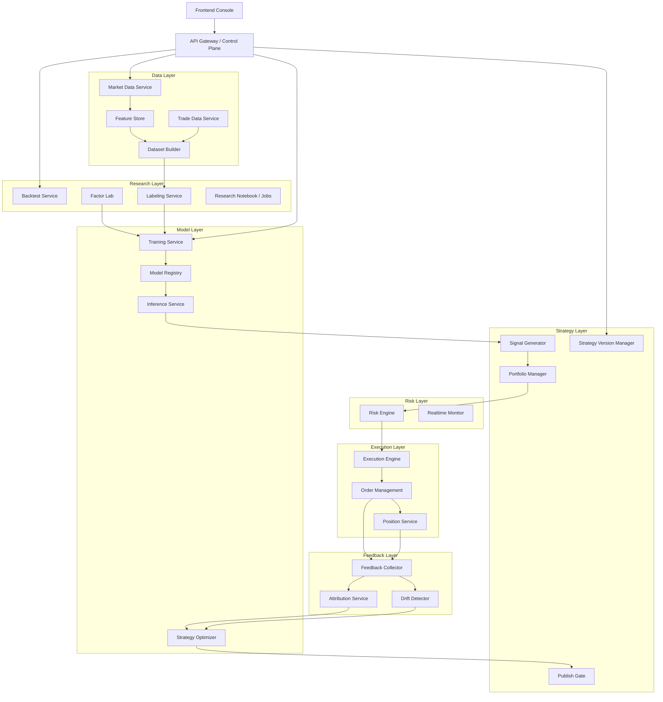

# AI 量化交易平台架构设计与目录重构方案

本文档用于将当前 `QuantyTrade` 从“策略执行平台”逐步升级为“AI 量化交易平台”。

目标不是继续围绕单个 Python 策略脚本做迭代，而是建立一个以`数据`、`特征`、`模型`、`评估`、`执行`、`反馈闭环`为核心的平台。

## 1. 当前项目现状

### 1.1 当前本质

当前项目本质是一个`策略平台`，不是完整的 AI 量化平台。

当前主链路：

1. 前端通过 HTTP API 管理策略实例、模板、仓位和日志。
2. Go 后端负责策略生命周期、交易所 websocket 行情订阅、统一风控和下单。
3. Python 策略脚本通过 Redis 收到历史/增量 K 线，计算交易信号。
4. Go 后端收到信号后再做风控、下单、记录订单和持仓。
5. 前端通过 `/ws` 接收日志、仓位、K 线和订单广播。

参考：

- [README.md](file:///Users/black/basis/quanty_trade/README.md)
- [call_chain.md](file:///Users/black/basis/quanty_trade/docs/call_chain.md)
- [main.go](file:///Users/black/basis/quanty_trade/backend/cmd/main.go)

### 1.2 当前架构优点

- 已具备统一交易执行层。
- 已具备交易所 websocket 和 REST 接入能力。
- 已具备策略模板、策略实例、仓位、订单、日志和回测的基础台账。
- 已具备 Python 策略运行时隔离和动态重启机制。
- 已具备前端控制台，可作为未来 AI 平台控制面板的基础。

### 1.3 当前架构短板

当前缺失的是 AI 量化平台的核心中台能力：

- 没有统一数据层。
- 没有特征工程层。
- 没有训练任务与模型服务。
- 没有模型注册与版本管理。
- 没有研究评估门禁。
- 没有策略发布、灰度、回滚流水线。
- 没有真正的“模型驱动信号”体系，仍然是“脚本驱动信号”。

## 2. 目标平台定义

### 2.1 目标

目标平台应支持以下闭环：

1. 实时与历史市场数据采集。
2. 自动生成研究样本、特征和标签。
3. AI/量化模型训练与评估。
4. 模型版本注册、策略版本管理和候选发布。
5. 实盘执行引擎使用“最新已发布模型/策略”进行下单。
6. 实盘结果持续回流，驱动再训练和再评估。

### 2.2 平台核心对象

未来系统不应以“单个 Python 文件”为核心，而应以以下对象为核心：

- 数据集 `dataset`
- 特征集 `feature_set`
- 标签定义 `labeling_rule`
- 模型 `model`
- 策略版本 `strategy_version`
- 组合配置 `portfolio_policy`
- 风控规则 `risk_policy`
- 执行任务 `execution_job`
- 评估报告 `evaluation_report`

## 3. 目标总架构

### 3.1 逻辑分层

目标平台分为 8 层：

1. 接入层 `Ingress Layer`
2. 数据层 `Data Layer`
3. 研究层 `Research Layer`
4. AI 层 `Model Layer`
5. 策略编排层 `Strategy Orchestration Layer`
6. 执行层 `Execution Layer`
7. 风控层 `Risk Layer`
8. 反馈闭环层 `Feedback Layer`

### 3.2 总体关系



## 4. 各核心服务说明

### 4.1 数据层

#### `Market Data Service`

职责：

- 接入 Binance websocket / REST。
- 采集 K 线、tick、盘口、资金费率、持仓量、成交。
- 统一标准化数据格式。
- 把实时数据写入缓存和长期存储。

当前可复用：

- `backend/internal/exchange`
- `backend/internal/strategy/strategy_dataflow.go`

建议演进：

- 把“行情采集”和“策略订阅推送”解耦。
- 让 `Market Data Service` 成为独立服务，策略执行只消费其标准数据。

#### `Trade Data Service`

职责：

- 统一管理订单、成交、仓位、PnL、资金变动。
- 汇总实盘和回测的交易流水。
- 作为训练和归因的数据来源。

当前可复用：

- `StrategyOrder`
- `StrategyPosition`
- `ExchangeOrderEvent`

#### `Feature Store`

职责：

- 存放技术指标、行为特征、成交微结构特征、市场 regime 特征。
- 统一为训练和实时推理提供相同口径特征。

当前状态：

- 尚未建设。

### 4.2 研究层

#### `Backtest Service`

职责：

- 支持历史回测、滚动窗口回测、walk-forward 验证。
- 评估收益、回撤、胜率、换手、滑点敏感性。

当前可复用：

- `backend/internal/strategy/strategy_backtest.go`

但当前问题：

- 仍偏脚本型回测，不是面向模型和组合的回测框架。

#### `Labeling Service`

职责：

- 构建训练标签。
- 支持未来 N 分钟收益、三分类方向、止盈止损触发结果、风险调整后标签等。

#### `Factor Lab`

职责：

- 管理传统量价因子、微观结构因子、衍生品因子、替代数据因子。
- 支持实验、筛选和因子组合。

### 4.3 AI 层

#### `Training Service`

职责：

- 模型训练调度。
- 支持定时训练和事件驱动训练。
- 产出模型文件、元数据、评估报告。

#### `Model Registry`

职责：

- 管理模型版本、输入特征版本、训练参数、训练窗口、评估指标。
- 区分 `candidate`、`approved`、`online` 状态。

#### `Inference Service`

职责：

- 为实时执行提供统一推理接口。
- 对某个 symbol / feature vector 返回预测分数、方向、置信度、建议仓位。

#### `Strategy Optimizer`

职责：

- 在“模型驱动”体系成熟前，负责 AI 辅助优化策略代码或参数。
- 未来逐步从“优化脚本”转为“优化参数 / 模型配置 / 组合逻辑”。

当前已落地雏形：

- [strategy_autotune.go](file:///Users/black/basis/quanty_trade/backend/internal/strategy/strategy_autotune.go)

### 4.4 策略编排层

#### `Signal Generator`

职责：

- 统一从模型、规则、因子中生成可交易信号。
- 支持单模型、多模型投票、规则+模型融合。

#### `Portfolio Manager`

职责：

- 把单标的信号转成组合权重、分配规模、资金占用方案。
- 控制行业暴露、方向暴露、单标的权重。

#### `Publish Gate`

职责：

- 对候选模型或候选策略版本做门禁审查。
- 门禁项包括：
  - 回测收益是否提升
  - 回撤是否可控
  - 交易频率是否异常
  - 风险暴露是否异常
  - 代码/模型是否可回滚

### 4.5 执行层

#### `Execution Engine`

职责：

- 连接交易所 websocket。
- 收到批准后的信号并下单。
- 负责撤单、补单、TPSL、滑点和异常重试。

当前可复用：

- `backend/internal/strategy/strategy_execution.go`
- `backend/internal/strategy/strategy_position.go`
- `backend/internal/exchange`

### 4.6 风控层

#### `Risk Engine`

职责：

- 管理账户级、策略级、标的级风险限制。
- 包括并发仓位、回撤限制、波动率熔断、资金占用、冷却期等。

当前可复用：

- `strategy_signal.go`
- `strategy_position.go`
- `strategy_tpsl_monitor.go`

### 4.7 反馈闭环层

#### `Feedback Collector`

职责：

- 把实盘订单、仓位、PnL、风控拦截、信号命中率回流到研究层。

#### `Attribution Service`

职责：

- 分析收益来自哪些模型、哪些因子、哪些市场状态。

#### `Drift Detector`

职责：

- 检测模型漂移、市场风格漂移和特征失效。
- 触发再训练或降级策略。

## 5. 建议的技术形态

### 5.1 控制面与数据面分离

未来建议拆成两大面：

- `Control Plane`
  - 用户、权限、模板、模型版本、发布审批、任务调度、可视化。
- `Data Plane`
  - 行情采集、特征生成、实时推理、风控、下单执行。

### 5.2 服务拆分原则

初期不建议直接拆成大量独立微服务，而是先按模块清晰拆目录和边界，再视负载拆进程。

推荐三阶段：

1. 单体分模块
2. 控制面 / 执行面双进程
3. 数据服务 / 训练服务 / 推理服务独立部署

## 6. 目录重构目标

### 6.1 当前目录问题

当前 `backend/internal/strategy` 目录承担了过多职责：

- 生命周期
- 行情订阅
- 信号处理
- 下单
- 风控
- 回测
- AI 优化
- 状态同步

这会导致：

- 模块边界不清晰
- “研究”和“执行”混在一起
- 后续接入模型和训练服务困难

### 6.2 目标目录树

建议把后端逐步重构为如下结构：

```text
backend/
  cmd/
    server/
      main.go
    worker/
      main.go
    trainer/
      main.go

  internal/
    api/
      gateway/
      handlers/
      middleware/
      dto/

    app/
      runtime.go
      bootstrap.go

    auth/
    logger/
    conf/
    secure/
    ws/

    domain/
      strategy/
      order/
      position/
      market/
      model/
      research/
      risk/

    repository/
      mysql/
      sqlite/
      redis/

    data/
      marketdata/
        collector.go
        publisher.go
        replay.go
      tradedata/
        order_store.go
        position_store.go
        pnl_store.go
      featurestore/
        store.go
        schema.go
      dataset/
        builder.go
        labeling.go

    research/
      factor/
        library.go
        experiments.go
      backtest/
        engine.go
        runner.go
        metrics.go
      evaluation/
        report.go
        gate.go

    ai/
      optimizer/
        strategy_optimizer.go
        prompt_builder.go
        code_validator.go
      training/
        trainer.go
        scheduler.go
      inference/
        service.go
        model_runtime.go
      registry/
        model_registry.go
        versioning.go

    strategy/
      orchestrator/
        signal_generator.go
        portfolio_manager.go
        publish_manager.go
      runtime/
        process_manager.go
        redis_bridge.go
        template_loader.go
      scripts/
        adapter.go

    execution/
      engine/
        execution_engine.go
        order_router.go
      exchange/
        binance/
        mock/
      monitor/
        tpsl_monitor.go
        roi_monitor.go

    risk/
      engine/
        risk_engine.go
        position_limit.go
        drawdown_limit.go
      policy/
        account_policy.go
        strategy_policy.go

    jobs/
      daily_pnl.go
      auto_optimize.go
      retrain.go
      model_review.go

    models/
      models.go
```

## 7. 前端目录重构建议

当前前端还比较薄，建议同步按“控制台”思路拆层：

```text
frontend/src/
  app/
    router.tsx
    providers.tsx

  pages/
    dashboard/
    strategies/
    models/
    research/
    risk/
    positions/
    settings/

  features/
    strategy-editor/
    strategy-runtime/
    market-monitor/
    portfolio-monitor/
    model-registry/
    model-training/
    backtest-center/
    ai-optimizer/
    risk-console/

  components/
    common/
    layout/
    charts/
    tables/

  services/
    api/
    ws/

  stores/
    auth/
    strategy/
    position/
    market/
    model/

  types/
  utils/
  hooks/
```

## 8. Python 侧未来定位

### 8.1 当前定位

当前 Python 是策略核心计算层。

### 8.2 未来定位建议

未来 Python 不应再承担“平台核心控制”职责，而应转型为以下两类角色之一：

#### 角色 A：研究脚本

- 用于 notebook、实验、回测、因子验证、模型训练。
- 不直接参与实时执行。

#### 角色 B：推理插件

- 用于承载特定模型推理逻辑。
- 由 Go 执行层通过标准接口调用。

### 8.3 未来目录建议

```text
strategies/
  runtime/
    adapters/
    templates/
    legacy/

research/
  notebooks/
  experiments/
  datasets/
  factors/
  models/
  reports/

python/
  quant_sdk/
    data/
    features/
    labels/
    backtest/
    inference/
```

## 9. 数据流重构建议

### 9.1 当前数据流

```text
交易所WS -> Go Manager -> Redis -> Python脚本 -> Redis -> Go风控下单
```

### 9.2 目标数据流

目标拆成两条流：

#### 实时执行流

```text
交易所WS
-> Market Data Service
-> Feature Service
-> Inference Service / Signal Generator
-> Portfolio Manager
-> Risk Engine
-> Execution Engine
-> Exchange
```

#### 研究训练流

```text
订单/仓位/行情历史
-> Dataset Builder
-> Labeling Service
-> Training Service
-> Evaluation Gate
-> Model Registry
-> Publish Manager
-> 在线推理
```

## 10. 数据库与核心表扩展建议

在保留现有 `strategy_orders`、`strategy_positions` 基础上，建议新增：

- `market_candles`
- `market_ticks`
- `market_orderbooks`
- `feature_sets`
- `feature_values`
- `datasets`
- `dataset_snapshots`
- `training_jobs`
- `model_versions`
- `model_artifacts`
- `evaluation_reports`
- `publish_records`
- `strategy_versions`
- `portfolio_allocations`
- `risk_events`
- `drift_events`

当前已可复用表：

- `strategy_templates`
- `strategy_instances`
- `strategy_orders`
- `strategy_positions`
- `exchange_order_events`
- `strategy_optimization_runs`

## 11. 推荐迁移路线

### Phase 1：从策略平台升级为 AI 辅助策略平台

目标：

- 保留现有实时执行架构。
- 引入数据抽取、优化记录、回测门禁、版本发布。

落地项：

1. 抽离 `strategy_autotune` 到独立 `ai/optimizer` 模块。
2. 建立 `strategy_versions` 表和发布记录表。
3. 候选策略必须先回测，再允许替换线上版本。
4. 前端新增“AI 优化记录”和“策略版本回滚”页面。

### Phase 2：建设研究中台

目标：

- 让训练、评估、回测从脚本流程中独立出来。

落地项：

1. 引入 `research/backtest` 模块。
2. 建立 `dataset builder` 和 `feature store`。
3. 建立训练任务与模型注册表。
4. 实现统一评估报告。

### Phase 3：模型驱动执行

目标：

- 把实时信号来源从“脚本逻辑”为主，迁移到“模型推理”为主。

落地项：

1. 引入 `inference service`。
2. `Signal Generator` 同时支持模型输出和规则输出。
3. `Portfolio Manager` 统一控制资金分配。
4. 逐步淘汰直接以 Python 单脚本为核心的生产策略。

### Phase 4：多模型与组合平台

目标：

- 平台管理多个模型、多个风格和多个账户。

落地项：

1. 多模型组合。
2. 多策略组合。
3. 跨账户/跨子策略风控。
4. 自动漂移检测和自动再训练。

## 12. 最小可执行重构清单

建议按下面顺序开工：

1. 新建 `backend/internal/ai`
2. 新建 `backend/internal/research`
3. 新建 `backend/internal/data`
4. 把 `strategy_autotune.go` 迁到 `ai/optimizer`
5. 把回测相关代码迁到 `research/backtest`
6. 把交易所适配迁到 `execution/exchange`
7. 把风控相关逻辑迁到 `risk/engine`
8. 把策略运行时托管迁到 `strategy/runtime`
9. 新建 `model registry` 与 `strategy version` 数据表
10. 前端新增 `models`、`research`、`ai-optimizer` 页面

## 13. 你当前项目的正确演进方向

结论只有一句：

> 当前项目应该从“策略脚本驱动的执行平台”，演进为“模型与数据驱动的 AI 量化平台”。

也就是说：

- 近期重点：让 AI 参与优化、评估、发布。
- 中期重点：让模型替代脚本成为核心信号源。
- 长期重点：让平台具备自动训练、自动评估、自动发布和自动回滚能力。

## 14. 下一步建议

建议下一步直接做以下其中一项：

1. 落第一版目录骨架，不迁移业务，只先把模块占位建出来。
2. 先拆 `strategy_autotune` 到 `ai/optimizer`，作为第一块真正的模块重构。
3. 补 `strategy_versions`、`model_versions`、`publish_records` 三张核心表。
4. 增加“候选策略回测通过后才能发布”的门禁。

如果要按最稳妥路线推进，推荐顺序是：

1. 目录骨架
2. 版本表
3. 发布门禁
4. AI 优化模块化
5. 研究层与模型层
